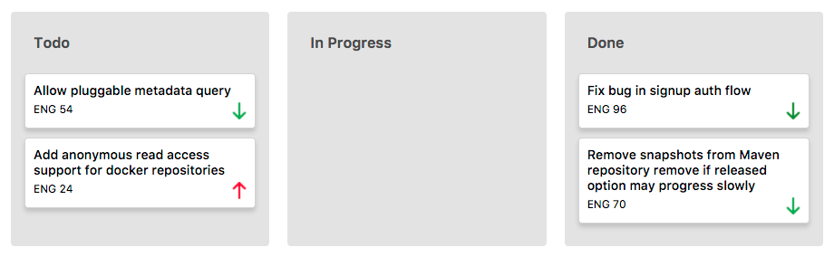

[Yeti live][yeti]
[yeti]: http://www.goyeti-herokuapp.com

Yeti is a project management and collaboration tool inspired by Jira and built with Ruby on Rails and React/Redux.

### Features and Implementation

#### Issue History
In order to persist the history of issues through multiple changes, an audit table
generates a record containing the previous state and that new state. The `PATCH` request made to the Issue table and the `POST` to the IssueAudit table are performed in a transaction. A future implementation would be to restrict updating to users with an authorized account type.


#### Sprint Boards

```javascript
dragStart(id, status_id){
  return(e) => {
    const data = {
      issue_id: id,
      current_status_id: status_id
    };
    e.dataTransfer.setData('text', JSON.stringify(data));
  }
}
```




### Future Directions
