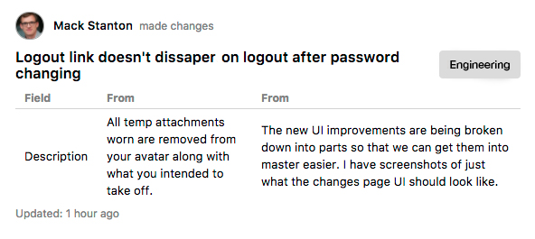
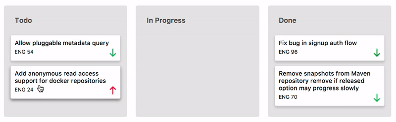

[Yeti live][yeti]

[yeti]: http://www.goyeti-herokuapp.com

Yeti is a project management and collaboration tool inspired by Jira and built with Ruby on Rails and React/Redux.

### Features and Implementation

#### Issue History


In order to persist the history of issues through multiple changes, an audit table
generates a record containing the previous state and that new state. The `PATCH` request made to the Issue table and the `POST` to the IssueAudit table are performed in a transaction. In order to expand what the audit table tracks in the future the name instead of keeping a duplicate column there is a `column_changed` column that stores the column name from the primary table. The response to updating an issue is the history object which only returns the necessary data need for the frontend components to re-render. A future implementation would be to restrict updating to users with an authorized account type.

```javascript
{ type: "RECEIVE_ISSUE_HISTORY",
  history: {
    id: 751,
    issue_id: 492,
    column_changed: "priority_type_id",
    from: "133",
    to: "135",
    resolution: "unresolved",
    created_at: "2017-09-01T16:09:15.542Z",
    user_id: 653,
  },
  issue: {
    id: 492,
    history_ids: [633,742, 751]
  }
```


#### Sprint Boards


The sprint board functionality was created using the HTML Drag and Drop API. On `dragStart` the selected issue's id and current_status_id are `set` using the `DataTransfer.setData` method. When the issue is then `dropped` on a container listening to an `onDrop` event the data is passed through the event (as outlined below.)
```javascript
dragStart(issueId, currentStatusId){
  return(e) => {
    const data = {
      issueId
      currentStatusId
    };
    e.dataTransfer.setData('text', JSON.stringify(data));
  }
}
```
The drop function receives the event containing the data property which is parsed to find the `containerStatusId`. A final check is made to make sure the issue has not been dropped onto its original container and then an action is dispatched to process the update request.

```javascript
drop(containerStatus){
  return (e) => {
    e.preventDefault();
    const containerStatusId = this.getStatusTypeId(statusTypes, containerStatus)
    const data = JSON.parse(e.dataTransfer.getData('text'));

    if(data.currentStatusId != containerStatusId){
     this.updateIssueStatus(data.issueId, containerStatusId)
    }
  }
}
```

### Future Directions

#### Slack Integration
When a user watches an issue, I want to create a slack web-hook to push the changes to immediately notify the user.

#### Rollback
By keeping track of all changes made to an issue I want to implement a feature that would allow the user to rollback to a certain point in time.

#### React Native
I want to experiment to see how components can be restructured to be used in a React Native Application with a focus on using the TouchBackend for drag and drop.

#### Filter & Search
